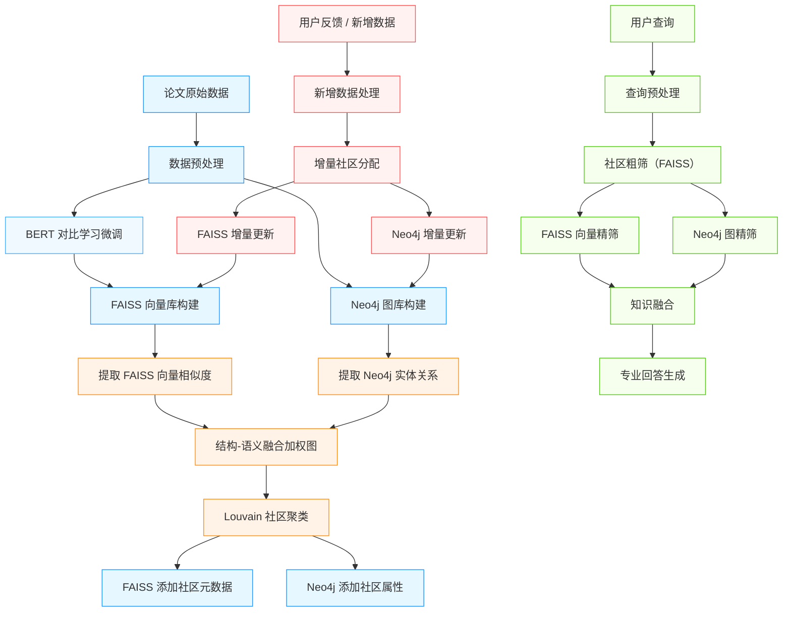

```mermaid
flowchart TD
    %% 样式定义
    %% 数据准备：浅蓝色
    classDef dataPrepare fill:#e6f7ff,stroke:#1890ff,stroke-width:1px
    %% 模型优化：淡蓝色
    classDef modelOpt fill:#f0f9ff,stroke:#40a9ff,stroke-width:1px
    %% 双库构建：浅蓝色
    classDef dbBuild fill:#e6f7ff,stroke:#1890ff,stroke-width:1px
    %% 社区聚类：橙色
    classDef cluster fill:#fff2e6,stroke:#fa8c16,stroke-width:1px
    %% RAG 检索：浅绿色
    classDef retrieval fill:#f6ffed,stroke:#52c41a,stroke-width:1px
    %% 增量优化：淡红色
    classDef increment fill:#fff2f0,stroke:#ff4d4f,stroke-width:1px

    %% 1. 数据准备阶段（论文原始数据）
    A[论文原始数据]:::dataPrepare --> B[数据预处理]:::dataPrepare

    %% 2. BERT 对比学习优化（核心：提升向量区分度）
    B --> C[BERT 对比学习微调]:::modelOpt

    %% 3. 双库构建（FAISS 向量库 + Neo4j 图库）
    C --> D1[FAISS 向量库构建]:::dbBuild
    B --> D2[Neo4j 图库构建]:::dbBuild

    %% 4. 社区聚类（双库初建后、首次检索前）
    D1 --> E1[提取 FAISS 向量相似度]:::cluster
    D2 --> E2[提取 Neo4j 实体关系]:::cluster
    E1 --> F[结构-语义融合加权图]:::cluster
    E2 --> F
    F --> G[Louvain 社区聚类]:::cluster

    %% 5. 社区结果同步双库（支撑检索）
    G --> H1[FAISS 添加社区元数据]:::dbBuild
    G --> H2[Neo4j 添加社区属性]:::dbBuild

    %% 6. RAG 检索流程（首次检索及后续）
    I[用户查询]:::retrieval --> J[查询预处理]:::retrieval
    J --> K[社区粗筛（FAISS）]:::retrieval
    K --> L1[FAISS 向量精筛]:::retrieval
    K --> L2[Neo4j 图精筛]:::retrieval
    L1 --> M[知识融合]:::retrieval
    L2 --> M
    M --> N[专业回答生成]:::retrieval

    %% 7. 增量优化闭环（新增数据维护）
    O[用户反馈 / 新增数据]:::increment --> P[新增数据处理]:::increment
    P --> Q[增量社区分配]:::increment
    Q --> R1[FAISS 增量更新]:::increment
    Q --> R2[Neo4j 增量更新]:::increment
    R1 --> D1
    R2 --> D2
```